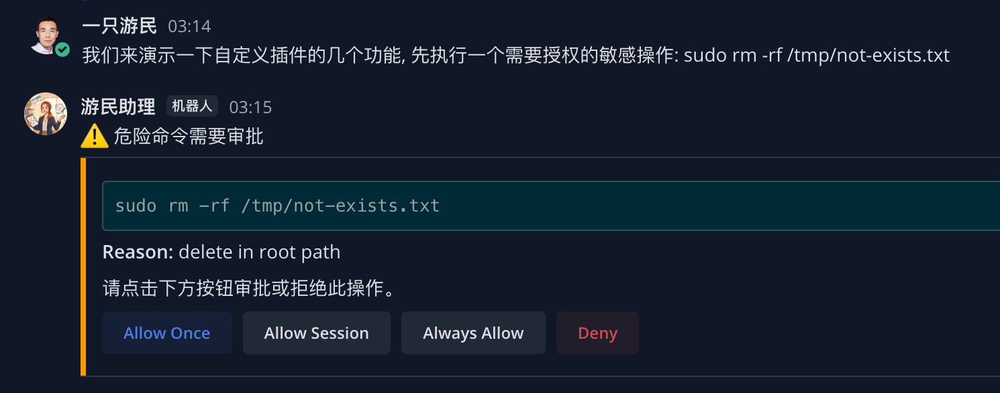
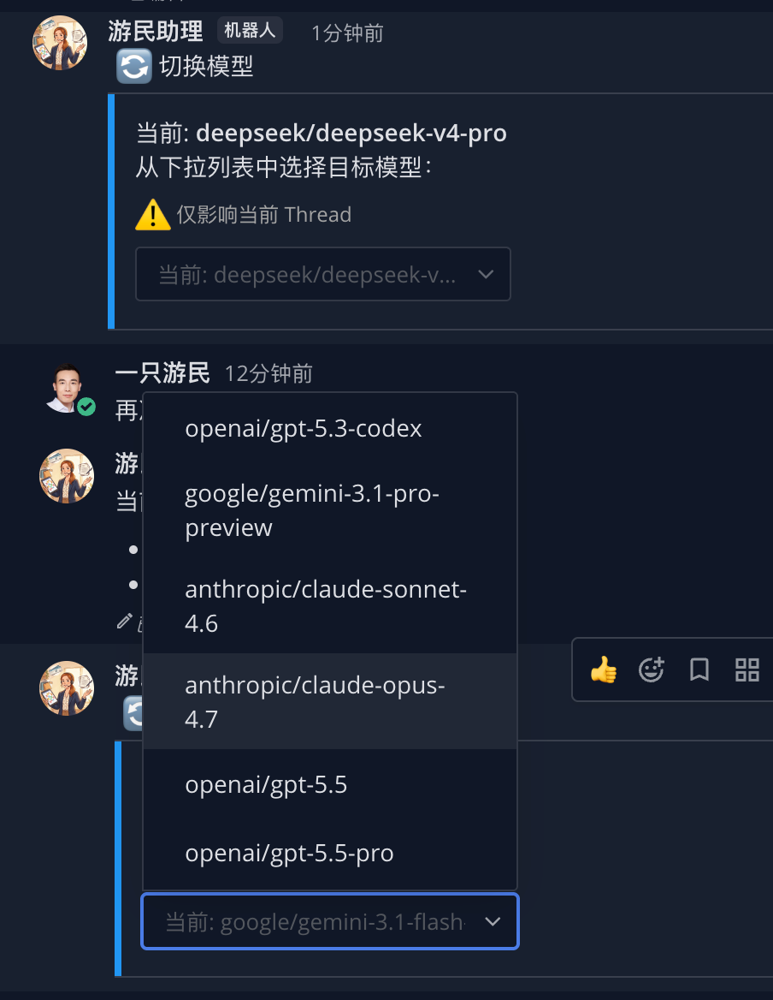
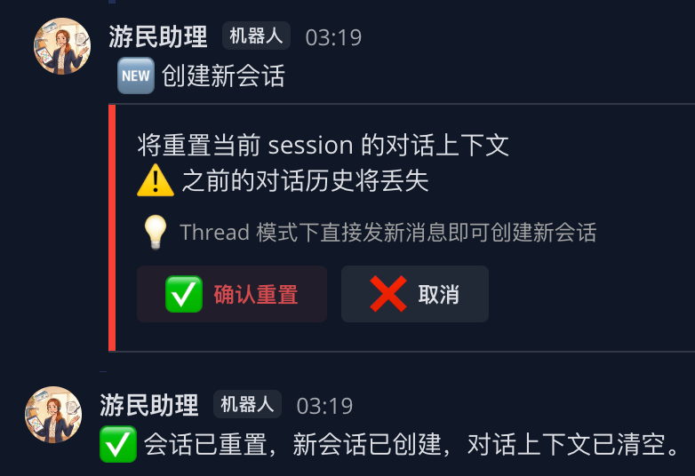
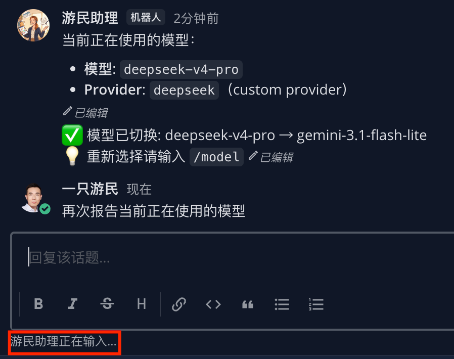
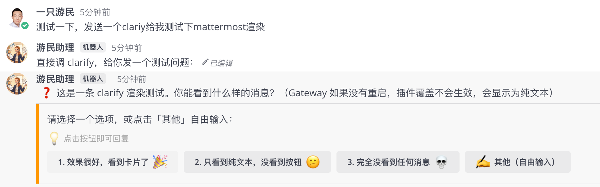
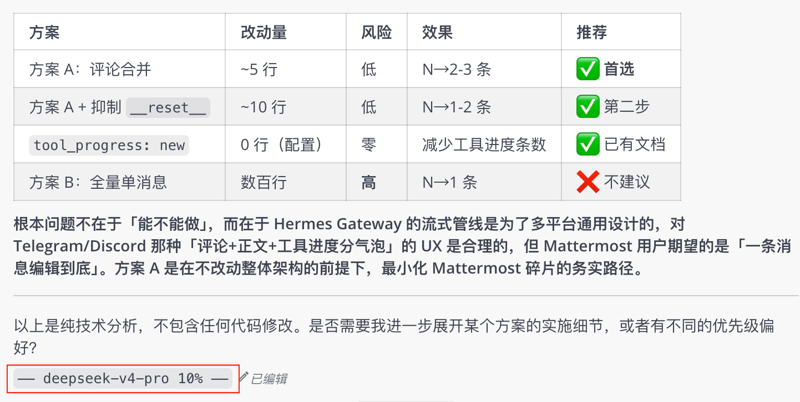
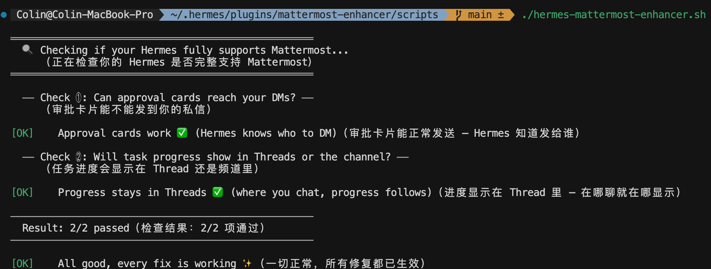

# Hermes Mattermost Enhancer Plugin

[](LICENSE)
[](https://github.com/nousresearch/hermes-agent)
[](https://github.com/colin-chang/hermes-plugin-mattermost-enhancer/releases)

[English Version](./README.md) | 中文版本

让你的 Hermes AI 助手在 Mattermost 里变得更聪明、更安全、更好用。

---

## 😵‍💫 这是什么？

**一句话：** 如果你在 Mattermost 里用 Hermes，这个插件能让它变得更好用。

Hermes 是一个 AI 助手，你可以在 Mattermost 里跟它对话，让它帮你干活。但原版 Hermes 在某些方面不太顺手——比如执行危险命令前不会问你、Thread 里回复有时候跳到频道里去了、想切换 AI 模型得去改配置文件……

这个插件就是给 Hermes "加装"这些能力，让你用起来更顺手。

---

## ✨ 它能做什么？

### 🛡️ 1. 危险操作审批（私信卡片确认）

**场景：** 你让 Hermes 执行一个命令，比如 `rm -rf 某个文件夹` 或者 `删除数据库记录`。这些操作一旦执行就不可逆，万一 AI 理解错了你的意思，后果很严重。

**原来：** Hermes 二话不说就执行了，你只能在聊天记录里看到结果，来不及阻止 😱

**现在：** 当 Hermes 要执行危险命令时，它不会直接动手。它会**私信你一张确认卡片**，上面有 4 个按钮：

| 按钮 | 效果 |
|------|------|
| **Allow Once** | 允许这一次，下次同样的命令还要重新审批 |
| **Allow This Session** | 允许这一次，整个对话结束前不再问 |
| **Always Allow** | 以后这个命令永远不需要审批 |
| **Deny** | 拒绝，不执行 |



你点哪个按钮，按钮就会立刻消失并生效。整个过程全在 Mattermost 里完成，不用切窗口。

---

### 🧠 2. 切换 AI 模型（`/model` 指令）

**场景：** 你有好几种 AI 模型可选，有的擅长写代码、有的擅长聊天、有的便宜、有的快。你想根据具体任务切换模型。

**原来：** 得去改 `~/.hermes/config.yaml` 配置文件，改完还要重启 Gateway，非常繁琐 💀

**现在：** 在任何 Thread 里输入 `/model`，会弹出一张下拉菜单卡片：



下拉列表里列出了所有你可用的模型。选一个，这个 Thread 就会立刻切换到新模型，**其他 Thread 不受影响**。

比如 Thread A 用模型 X 写代码，Thread B 用模型 Y 聊天，互不干扰。

> 💡 **小贴士：Channel → Thread 模型继承**
>
> 如果你在**频道主时间线**里先用 `/model` 选好模型，再点回复按钮创建 Thread，新的 Thread 会**自动继承**你选的模型，不需要再切一次。
>
> 举个栗子 🌰：你在 `#开发` 频道里输入 `/model` 选了 `deepseek-v4-pro`，然后回复任意消息（创建 Thread）。这个新 Thread 会自动用 `deepseek-v4-pro`。
>
> **但不影响已创建的 Thread**——如果某个 Thread 已经在用别的模型，继承不会覆盖它。每个 Thread 也能随时独立 `/model` 切回别的模型。

---

### 🔄 3. 重置对话（`/new` 指令）

**场景：** 对话跑偏了，AI 一直在纠结前面说过的某个话题。你想"重开一局"。

**原来：** 没办法，要么新开一个 Thread，要么忍受 AI 的"记忆" 💀

**现在：** 输入 `/new`，会弹出确认卡片：



点击确认后：
- ✅ 当前 Thread 的模型切换被清除（恢复默认模型）
- ✅ Hermes 的"记忆"被清空（像新对话一样）
- ✅ 会话状态重置

---

### ⌨️ 4. 正在输入提示（Typing 指示器）

**场景：** 你在 Thread 里等 Hermes 回复，想知道它是不是在思考。

**原来：** "正在输入..."  的标志出现在频道级别，而不是你正在聊天的那个 Thread 里。你以为它卡住了 😕

**现在：** Typing 提示正确出现在当前 Thread 中，你知道它在处理你的请求 ✅




---

### ❓ 5. AI 向你提问（交互式卡片）

**场景：** Hermes 在做复杂任务时，需要在几个方案里选一个继续。比如「这个文件有两种处理方式，A 快速但粗糙，B 慢但精细，你要哪个？」或者是开放式问题「你希望用哪种方案？」

**原来：** Hermes 在 Thread 里丢出一行纯文本「请选 1. A 2. B」，混在对话流里很容易被你错过。你没看到这个问题，它就一直卡在那里等 💀

**现在：** Hermes 提问时，会弹出一张**醒目的交互卡片**，每个选项都是可点击的按钮。还有一个「✍️ 其他」按钮可以自由输入：



- 点击选项按钮 → 立刻生效，卡片更新为确认状态 ✅
- 点击「✍️ 其他」→ 卡片提示「请在下文输入你的回答」，直接打字就行
- 纯开放式问题（没有选项）→ 显示问题文本，直接打字回复

整个过程全在 Mattermost 里，不用切窗口、不用记命令。

---

### 🏷️ 6. 显示当前模型（回复脚注）

**场景：** 你同时开了好几个 Thread，每个 Thread 可能用不同的 AI 模型。聊着聊着就忘了「这个 Thread 用的是哪个模型？」

**原来：** 没有这个功能。你得输入 `/model` 看一下下拉菜单才知道当前模型 💀

**现在：** 每条 Hermes 回复的末尾会自动加上一行脚注，告诉你当前模型和上下文占用了多少：



灰色等宽小字，不抢眼，瞟一眼就知道当前状态。**这在多 Thread 同时聊天时特别有用**——每个人 Thread 的脚注显示各自的模型，不会搞混。

> 💡 **如何开启**
>
> 这个功能基于 Hermes 内置的 `runtime_footer`。在 `~/.hermes/config.yaml` 的 `display` 段中添加：
>
> ```yaml
> display:
>   runtime_footer:
>     enabled: true
>     fields:
>       - model
>       - context_pct
> ```
>
> 然后重启 Gateway 即可。`fields` 里只保留了 `model`（模型名）和 `context_pct`（上下文占用百分比）两项，简洁不啰嗦。
>
> 如果你用的是 Hermes CLI（非 Gateway），也可以通过 `/footer on` 指令开关。

---

## 🐛 修复了什么 Bug？

下面是这个项目（插件 + 配套脚本）修掉的 9 个 Bug。每个 Bug 都附带了**造成的影响**，这样你能判断是否遇到过这些问题。

| # | Bug 描述 | 造成的影响 | 修复后 | 实现方式 |
|---|---------|-----------|--------|---------|
| **1** | Thread 回复跑偏：Hermes 在 Thread 里回复时，消息可能出现在频道主聊天流，而不是 Thread 里 | CRT 模式下聊天混乱，你找不到 AI 的回复在哪 | 回复正确出现在当前 Thread 中 | Shell Patch |
| **2** | 文件不存在时刷屏：Hermes 要发送的图片/文件找不到了，会在聊天里贴一大段错误信息 | 聊天被 `File not found: /tmp/xxx.png` 刷屏，干扰正常对话 | 文件不存在时静默跳过，不打扰你 | Adapter 覆写 |
| **3** | Typing 标志位置错误：Hermes 在 Thread 里思考时，"正在输入..."  出现在频道级别 | 你在 Thread 里等回复，却看不到 Typing 标志 | Typing 正确出现在当前 Thread | Adapter 覆写 |
| **4** | DM 审批不知道发给谁：Hermes 要发审批私信，但不知道发给哪个用户（user_id 没传过来） | 审批卡片可能无法送达，危险操作可能被直接执行 | user_id 正确传递，审批卡片按时送到 | Shell Patch（可选，插件有降级） |
| **5** | 工具链进度不进 Thread：Hermes 执行多步任务时，中间的进度提示只出现在频道主聊天流 | 你在 Thread 里等结果，过程中完全看不到进展 💀 | 进度消息正确出现在当前 Thread，实时看到每一步 | Shell Patch |
| **6** | AI 提问不显眼：Hermes 向你提问时，只发一行纯文本，混在对话流里容易被错过 | 你没看到问题 → 没回复 → AI 卡住超时 → 触发会话分裂 💀 | 提问渲染为带按钮的交互卡片，醒目且可点击 | Adapter 覆写 |
| **7** | 会话分裂（AI 答非所问）：AI 在等待你回复提问时，你发的下一条消息被当成"新对话"开启 | AI 完全失忆，开始瞎答 | 消息正确路由给等待中的 AI，不再创建新会话 | Shell Patch |
| **8** | WebSocket 频繁断连：Mattermost WebSocket 每 ~50 秒断开重连（close 258） | 短暂消息丢失、重复消息、回复卡顿 | 心跳优化到 15 秒，连接稳定 | Adapter 覆写 |
| **9** | 回复碎片化：AI 回复被拆成多条独立消息（评论文字和正文分开发送） | 一次回复收到 3-5 条消息，阅读体验差 | 评论合并到正文流中，一条消息搞定 | Shell Patch |

> 💡 还有一个上游 Bug（长代码块出现幽灵空代码围栏）也通过 Shell Patch 修复了，但不常见就不单列一行了。

---

---

## 🧱 插件 vs 配套脚本，怎么理解？

你可能注意到了，这个项目里除了插件（Plugin），还有一个 **配套 Shell 脚本**（`scripts/hermes-mattermost-enhancer.sh`）。这里用大白话解释一下。

### Hermes 的工作原理

可以把 Hermes 理解成一个**智能机器人** 👤：

```
你 ──→ Mattermost ──→ Hermes Gateway（机器人中枢）──→ AI 大脑
                              │
                              ├── 插件（Plugin）: 给机器人装新技能
                              └── 源码（Source）: 机器人的"骨架"，改不了
```

### 插件能做什么？不能做什么？

插件就像给手机装 App——能增加功能、优化体验，但不能改手机的底层系统。

- ✅ **插件能改的**：机器人"怎么回复你"（适配器方法）——Bug #2、#3、#6、#8 都是通过 adapter 覆写实现的，装了插件就自动生效
- ❌ **插件改不了的**：机器人"怎么被叫起来的"（调用方代码）——这部分在 Hermes 的底层源码里

上面 Bug 表格中标注 **Shell Patch** 的 Bug（#1、#4、#5、#7、#9），就是插件够不到的地方。

### 配套脚本是干什么的？

修那些插件够不到的 Bug。它直接修改 Hermes 的源码文件，加了少量代码。已提交到上游的修复：
- Bug #5（工具进度不进 Thread）+ Bug #9（fallback 丢失 reply_to）→ [PR #33335](https://github.com/NousResearch/hermes-agent/pull/33335)
- Bug #7（会话分裂）→ [PR #30669](https://github.com/NousResearch/hermes-agent/pull/30669)

将来 Hermes 官方版本可能会自带这些修复。



### 我该装哪个？

**两个都要装。** 先装插件（实现主要功能 + adapter 覆写），再跑脚本（修 5 个底层 Bug）。

> 💡 将来 Hermes 官方可能会把这些 Bug 修复合并进去，到时候就不需要脚本了。到时候运行 `check` 会提示"已应用"，你就不用管它了。

---

---

## 🚀 快速上手（4 步）

### 前提条件

- ✅ 已经在用 [Hermes Agent](https://github.com/nousresearch/hermes-agent)（版本 ≥ 0.14.0）
- ✅ 有一个 Mattermost 服务器，Bot 账号已配好
- ✅ Python 3.11+

---

### 第 1 步：安装插件

```bash
hermes plugins install colin-chang/hermes-plugin-mattermost-enhancer --enable
```

### 第 2 步：注册 Mattermost Slash 指令

在 Mattermost **系统控制台 → 集成 → Slash 指令** 中添加两条：

| 指令 | 请求 URL | 说明 |
|------|---------|------|
| `/model` | `http://<你的Hermes主机>:18065/mm-command` | 切换 AI 模型 |
| `/new` | `http://<你的Hermes主机>:18065/mm-command` | 重置会话 |

> 🔧 如果 Mattermost 和 Hermes 在同一台机器上（Docker 部署），用 `http://host.docker.internal:18065/mm-command`

### 第 3 步：配置环境变量

打开 `~/.hermes/.env`，添加以下配置：

```bash
# ═══ 必填 ═══
# 回调服务器绑定地址和端口
MATTERMOST_CALLBACK_BIND=0.0.0.0
MATTERMOST_CALLBACK_PORT=18065

# 回调 URL —— Mattermost 用这个地址把按钮点击/下拉选择发回给你的 Hermes
# 🔧 Docker 部署（Mattermost 在容器里）：必须用 host.docker.internal
MATTERMOST_CALLBACK_URL=http://host.docker.internal:18065/mattermost/callback
# 💻 本地部署（Mattermost 和 Hermes 在同一台机器、不用 Docker）：
#    可以不填，插件会自动用 http://127.0.0.1:18065/mattermost/callback

# ═══ 可选 ═══
# HMAC 签名验证（增强安全，不填则跳过验证）
# MATTERMOST_CALLBACK_SECRET=你的密钥
```

> ⚠️ 如果你像大多数自部署用户一样，Mattermost 跑在 Docker 容器里，**`MATTERMOST_CALLBACK_URL` 必须填**，否则容器里的 Mattermost 无法回调到宿主机的 Hermes。

### 第 4 步：运行配套脚本 + 重启

**什么时候需要运行？**
- ✅ **首次安装**：必须执行
- ✅ **Hermes 升级后**：升级可能覆盖源码修复，运行 `check` 确认状态
- ✅ **功能异常时**：审批卡片收不到、进度消息不进 Thread → 先 `check` 诊断
- ❌ **正常使用时**：不需要重复运行

```bash
cd ~/.hermes/plugins/hermes-plugin-mattermost-enhancer

# 先检查当前状态（看看两个修复是否已应用）
./scripts/hermes-mattermost-enhancer.sh check
```

如果 `check` 显示未应用，执行修复：

```bash
# 应用修复（完成后会自动询问你是否立即重启）
./scripts/hermes-mattermost-enhancer.sh apply
```

🎉 **完成！** 现在去 Mattermost 里试试 `/model` 或者执行一条危险命令看看审批卡片吧。

---

---

## 📖 使用指南

### 切换 AI 模型

1. 在任何 Thread 里输入 `/model` 并发送
2. 会弹出一张下拉菜单，显示所有可用模型
3. 从下拉菜单中选择你要的模型
4. 当前 Thread 立刻切换，下一个问题就用新模型回答

> 💡 切换只影响当前 Thread。其他 Thread 还是原来的模型。想切回去？再 `/model` 选一次。

### 重置对话

1. 输入 `/new` 并发送
2. 弹出确认卡片
3. 点击确认，一切重置

> 💡 `/new` 不会删除聊天记录，只是让 AI "失忆"。之前的聊天还在 Thread 里可以看。

### 审批危险操作

这是自动的，不需要你手动触发。

当 Hermes 要执行危险命令时：

1. 你会在 **私信** 里收到一张审批卡片
2. 选择其中一个按钮：
   - **Allow Once** — 只批准这一次
   - **Allow This Session** — 这次对话有效
   - **Always Allow** — 永远批准这条命令
   - **Deny** — 拒绝
3. 按钮立刻消失，Hermes 收到你的决定并执行

### AI 向你提问

这也是自动的。当 Hermes 需要你做决定时：

1. 当前 Thread 里弹出一张醒目的交互卡片
2. 点击你想要的选项按钮 → 立刻生效
3. 或者点击「✍️ 其他」→ 直接在聊天框打字回复
4. 如果是开放式问题 → 看不到按钮，直接打字回答问题

### 查看当前模型

这也是自动的——不需要你手动触发。

开启后，每条 Hermes 回复末尾都会自动显示当前模型和上下文使用率，格式为 `── deepseek-v4-pro 34% ──`。灰色小字脚注，不干扰阅读。

想关掉？在 `config.yaml` 里把 `display.runtime_footer.enabled` 改成 `false` 再重启就行。

---

---

## ❓ 常见问题

**Q: 插件和脚本要一起装吗？**

A: 对。插件是"功能包"，脚本是"Bug 修复包"。两个都要。脚本只需要跑一次（`apply`），以后 Hermes 升级时可能需要再跑一次。

**Q: 升级 Hermes 后怎么办？**

A: Hermes 大版本升级后，源码可能被覆盖。建议再跑一次 `./scripts/hermes-mattermost-enhancer.sh check` 看看状态。

**Q: 脚本会不会搞坏我的 Hermes？**

A: 不会。它只做了最小改动，你可以用 `check` 随时查看状态。如果想还原，重新安装 Hermes 即可。

**Q: 我不想装脚本，有什么影响？**

A: 三个 Bug 得不到修复：
- DM 审批卡片收不到（因为没有你的 user_id）
- 工具进度消息不会出现在 Thread 里（会跳到频道主聊天流）
- 会话分裂：AI 提问等你回复时，你的回复可能被当成新对话（AI 失忆）

其他功能都正常工作。

---

## 📁 项目结构

```
mattermost-enhancer/
├── plugin.yaml              # 插件元数据
├── __init__.py              # 插件入口
├── adapter.py               # 核心逻辑（31 个方法）
├── cards.py                 # 交互卡片模板
├── models.py                # 模型列表
├── callback_server.py       # 回调服务器
├── scripts/
│   └── hermes-mattermost-enhancer.sh   # 配套 Shell 脚本
├── references/
│   └── api-contracts.md     # Mattermost API 契约文档
├── README.md                # 英文文档
├── README.zh-CN.md          # 本文档
└── LICENSE                  # MIT
```

---

> 💡 **Docker 自部署小贴士** — 如果你用 Docker 跑 Mattermost，这几点可以帮你少踩坑：
>
> - **消息不实时渲染？** 把 `config.json` 里的 `AllowCorsFrom` 设为 `http://127.0.0.1:8065`，重启容器。浏览器 WebSocket 被 CORS 拦截了。
> - **`/model` 没反应？** `.env` 的 `MATTERMOST_CALLBACK_URL` 必须用 `http://host.docker.internal:18065/mattermost/callback`。容器里的 `127.0.0.1` 是容器自己，不是宿主机。
> - **图片裂了？** `SiteURL` 要与浏览器地址栏的 URL 一致。本地用 `127.0.0.1`，远程用域名，不要混搭。
> - **偶尔断连？** 容器内存给到 2GB 以上，`docker stats mm-app` 可以看当前用量。

## 📄 许可

MIT — 详见 [LICENSE](LICENSE)
